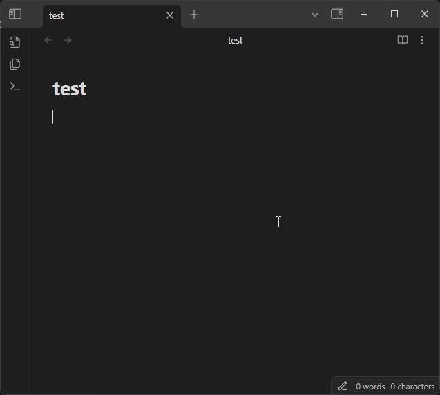
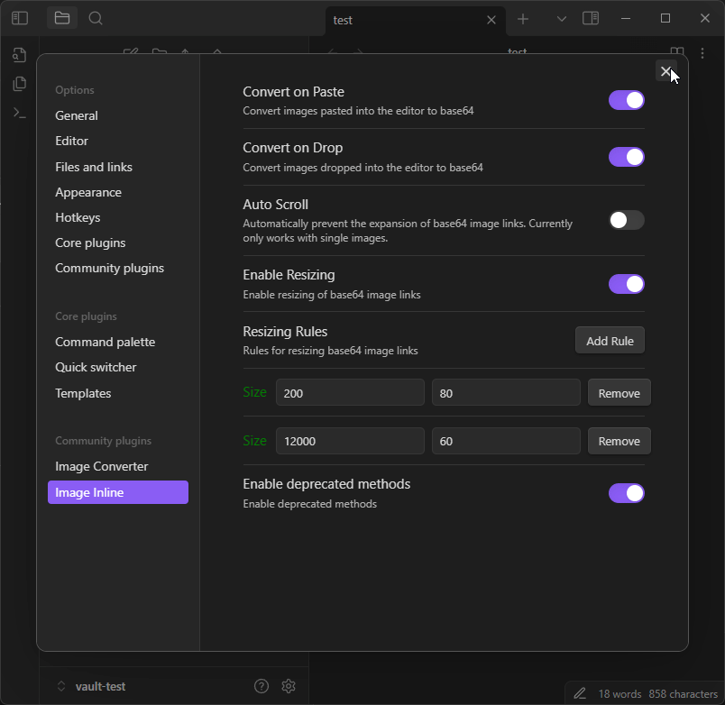
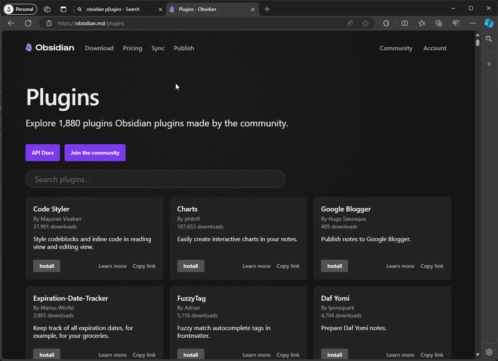
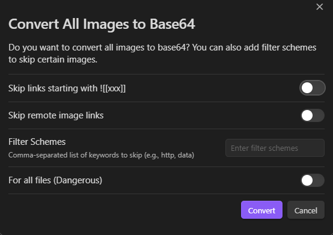

# Image-Inline
Some vaults just doesn't feel right to have image files. 

## Features
### Paste Image
Paste images directly from clipboard.

### Drag and Drop Image
Drag and drop images into the vault.

### Auto Scroll
Automatically scroll out of the expanded link

### Resizing
Easily resize images within the vault.

### (Deprecated) Convert All 
Convert all images to base64 embed. A newer Modal working in progress.

