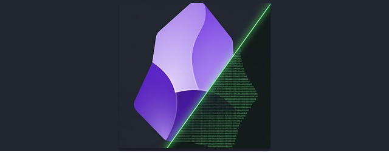

# Image Inline

Image Inline is an Obsidian plugin for keeping images inside your notes as inline data URLs instead of always creating attachment files.

It is useful for vaults where you want self-contained notes, fewer attachment folders, or a faster way to paste screenshots directly into Markdown.

## What it does

- Converts pasted images into inline Markdown image data URLs.
- Converts dropped images into inline Markdown image data URLs.
- Prevents large inline base64 strings from expanding noisily in the editor.
- Helps move the cursor out of inline data sections while editing.
- Supports optional resize and threshold-based attachment workflows.
- Adds context-menu actions for converting and exporting images.
- Adds batch commands for converting or exporting images across a note, folder, or entire vault.

## Current feature set

### Paste and drop

- `Convert on paste` can automatically inline pasted images.
- `Convert on drop` can automatically inline dropped image files.
- Mixed clipboard or drag content is left to Obsidian's normal handling.

### Editor behavior

- Inline image data URLs are visually collapsed in the editor so long base64 payloads do not flood the visible document.
- The cursor escape behavior helps move the caret out of inline image data sections during editing.

### Context menu actions

When the cursor is on a supported image line, the editor context menu can add:

- `Convert to Base64` for local `![[image.png]]` style embeds.
- `Convert online image to base64` for remote `` image links.
- `Export to Vault` for inline base64 image links.

### Command palette actions

- `Convert Images`
	Converts linked image embeds to inline base64, or converts inline base64 images back into attachment files.
- `Export Images`
	Exports inline base64 images and linked image embeds into vault attachments.

Both commands support these scopes:

- Current note
- Current folder
- Entire vault

## Image handling modes

Image Inline supports two configurable behaviors when resizing is enabled.

### Smaller strategy

- Images smaller than the configured threshold are inlined as base64.
- Images larger than the configured threshold are saved as attachments instead.

### Larger strategy

- Images larger than the configured threshold are resized before being inlined.
- Original images can optionally be backed up to the vault.
- Smaller files can optionally be resized as well.

If resizing is disabled, pasted and dropped images are inlined directly.

## Settings

The plugin currently exposes these settings in Obsidian:

- `Convert on paste`
- `Convert on drop`
- `Auto escape base64 data section`
- `Enable resizing`
- `Resizing strategy`
- `Size threshold`
- `Resize percentage`
- `Backup original images`
- `Resize smaller files`

## Notes and limits

- The batch convert and export flows currently target common image embed patterns used in this plugin, especially linked `png`, `jpg`, and `jpeg` note embeds.
- User-facing notices stay concise, while more detailed operational traces are available in the Obsidian developer console for debugging.
- The plugin is marked as not desktop-only in the manifest.

## Development

### Scripts

- `npm run build`
	Type-checks the plugin and builds the production bundle.
- `npm run test:utils`
	Runs the current Node-based test suite.

### Local development notes

- Entry point: `src/main.ts`
- Manifest: `manifest.json`
- Batch commands: `src/commands/`
- Editor/context integrations: `src/coms/` and `src/comsContext/`
- Shared conversion utilities: `src/utils/`

This repo uses focused utility and editor-helper tests with `node:test` and `tsx`.

